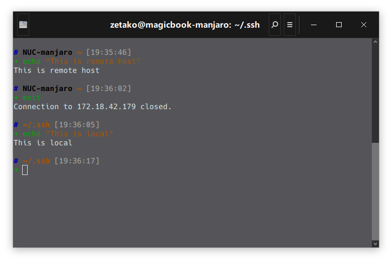

# Astro-SSH zsh theme
Astro theme is based on [`ys`](http://blog.ysmood.org/my-ys-terminal-theme/) theme and `robbyrushell` (default theme) theme.

Astro-SSH theme is based on Astro theme with a patch to show hostname when using ssh connect 

## Screenshots


## Installation
#### Clone the repository:
```
$ git clone https://github.com/zetako/astro-ssh-zsh-theme.git
```


#### Theme 
1. Copy `astro-ssh.zsh-theme` file into the `~/.oh-my-zsh/themes/` directory.
2. Change the theme variable name to `ZSH_THEME="astro-ssh"` in `~/.zshrc`
3. Reload ZSH with `source ~/.zshrc`

